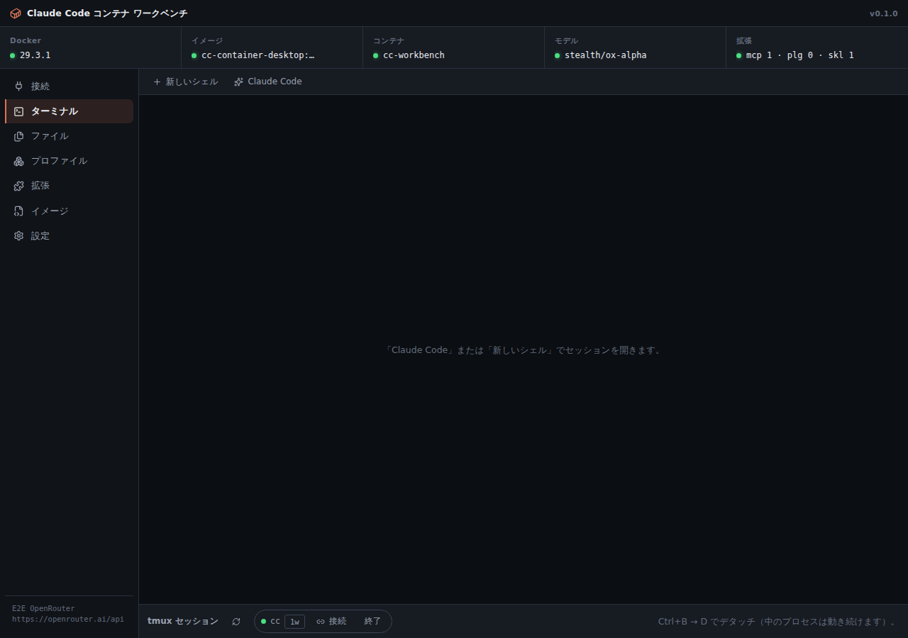
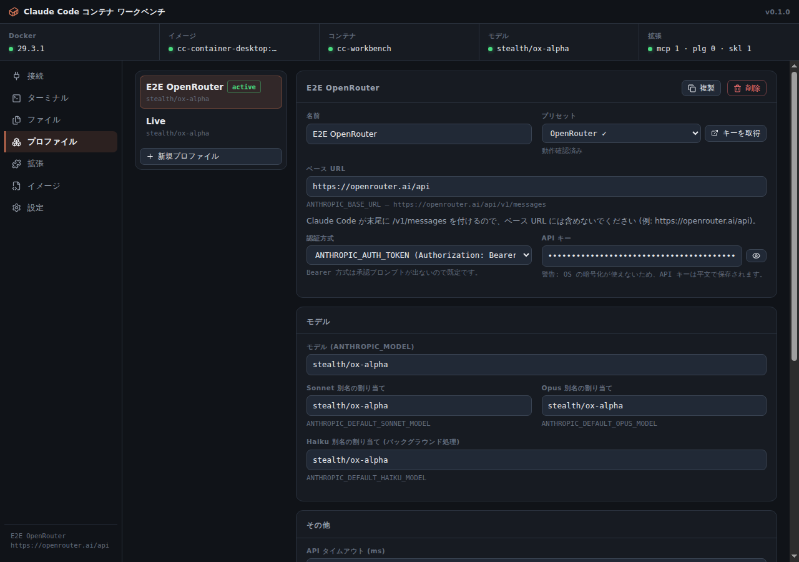

# Claude Code Container Workbench

An Electron desktop app for Windows 11 that runs Claude Code inside a Docker container, with the **endpoint, model and API key swappable per use case**. Nothing — not Node, not Claude Code — gets installed on the host.

日本語版は [README.md](README.md) を参照してください。







---

## What changed from the batch-file setup

|                                   | Before (`claude-container`)                                 | Now                                                                  |
| --------------------------------- | ----------------------------------------------------------- | -------------------------------------------------------------------- |
| Changing settings                 | Attach VS Code, hand-edit `settings.json`                   | Pick a profile, hit Apply                                            |
| Onboarding                        | Write `hasCompletedOnboarding` once, by hand                | Written **on every launch**, automatically                           |
| Reconnecting to a running session | Not possible — every `exec` started fresh                   | Reattaches to a tmux session; closing the tab leaves it running      |
| Poking at the internals           | Needed VS Code Remote Containers                            | Built-in file browser + editor; the Dockerfile is editable in the UI |
| GitHub CLI                        | Installed in the image                                      | **Not installed** — export the workspace manually                    |
| API key                           | Plain text in `settings.json`                               | OS encrypted store (DPAPI on Windows)                                |
| MCP / plugins / skills            | `claude mcp add` inside the container, files placed by hand | Held on the Extensions tab and written in on every apply             |
| Throwing it away                  | `docker rm`, then set everything up again                   | **New session** discards the container and its volume in seconds     |

---

## Requirements

- Windows 11 with **Docker Desktop** running
- Node.js 22+ only if you are building the app yourself

---

## Setup

```powershell
npm install
npm run build

npm run dev        # run in development
npm run dist:win   # build a Windows x64 installer into release/
```

---

## Using it

### 1. Build and start

On the **Connect** tab, top to bottom: check Docker is green → **Build** the image (first run only) → **Start** the container. The container just idles on `sleep infinity`; all work happens in `docker exec` sessions.

### 2. Configure the endpoint

On the **Profiles** tab:

- **Base URL** — a prefix only. Claude Code appends `/v1/messages`, so OpenRouter is `https://openrouter.ai/api`, **not** `https://openrouter.ai/api/v1`. The resolved URL is shown under the field.
- **Auth mode** — `ANTHROPIC_AUTH_TOKEN` (`Authorization: Bearer`) by default, because it never triggers Claude Code's one-time key-approval prompt. Switch to `ANTHROPIC_API_KEY` only for endpoints that want `x-api-key`.
- **API key** — stored in the OS encrypted store.
- **Models** — `ANTHROPIC_MODEL` plus what each of `sonnet` / `opus` / `haiku` resolves to.
- **Context window** — Claude Code assumes 200k for a model ID it does not recognize and compacts against that. Declaring the real window stops it throwing away context a large-window model could still hold.

Apply saves the profile and, if the container is running, pushes it in immediately.

### 3. Start / reattach

**Start / reattach Claude Code**, on the Connect tab or the Terminal tab. Each press:

1. merges `hasCompletedOnboarding: true` (and workspace trust) into `~/.claude.json` — merged, never clobbered
2. replaces the `env` block of `~/.claude/settings.json` from the active profile
3. runs `post-create.sh`
4. attaches to the tmux session (`cc` by default), creating it and launching Claude Code if it does not exist

**Closing the tab leaves Claude Code running.** The same button reattaches. The tmux session list at the bottom of the Terminal tab does the same thing explicitly.

### 4. Getting work out

There is no GitHub CLI in the container by design. Use **Files → Export workspace** and pick a destination; you get `<destination>/workspace_YYYYMMDD_HHMMSS/`.

### 5. Injecting MCP servers, plugins and skills

The **Extensions** tab holds them; they are written into the container whenever a profile is applied or a session starts.

- **MCP servers** — `stdio` (command, args, env) and `http` / `sse` (URL, headers). They go into the user scope of `~/.claude.json`, so they apply from any directory. **Check status** shows what `claude mcp list` says, verbatim.
- **Marketplaces** — `extraKnownMarketplaces` in `settings.json`, from a GitHub repo (`owner/repo`) or a URL.
- **Plugins** — `enabledPlugins`, enabled as `plugin@marketplace`.
- **Skills** — `~/.claude/skills/<name>/SKILL.md`, plus any extra files under `scripts/`, `references/` or `assets/` (anything in `scripts/` is written executable).

**A skill's directory comes from its frontmatter `name`**, which is why there is no separate name field: two names are two chances to disagree. `name` and `description` are both required — `name` is up to 64 characters of lowercase letters, digits and single hyphens, `description` up to 1024. A skill that misses any of that is not written, and the reason is shown next to it.

Fields **only Claude Code understands**, like `when_to_use`, are written but warned about: a claude.ai upload or the Skills API rejects them outright, so drop them if the skill has to travel.

A personal skill's `/command` is the **directory name** (frontmatter `name` is the display label). Since the app derives one from the other, they cannot drift apart.

The app manages **only the keys it created**. A server you added with `claude mcp add` inside the container is left alone; an entry you delete here is deleted in there too.

### 6. Throwing the session away

**New session**, at the bottom of the Connect tab.

It discards the container and the home volume and builds a fresh pair. The workspace, `~/.claude` and anything you `npm i -g`'d afterwards all go. **The image stays**, so whatever `setup.sh` installed at build time is still there and the reset itself takes seconds.

- **Export the workspace first** — copies it out before anything is destroyed
- **Rebuild the image too** — only when you want a newer Claude Code; this one takes minutes

Profiles, extensions and the onboarding flags are written back automatically afterwards.

---

## Poking at the internals

**Files tab** — browse and edit any file in the container, with quick links to `settings.json`, `.claude.json` and `CLAUDE.md`. Keys you add to `settings.json` by hand (`hooks`, `permissions`, `statusLine`) survive re-provisioning; only `env` is owned by the profile.

**Image tab** — edit the `Dockerfile`, `setup.sh` and `post-create.sh`. The Dockerfile defines the image (build, then recreate the container). `setup.sh` runs **once, at build time**, and is baked into the image, so slow toolchains belong there and it is the only thing that survives a reset. `post-create.sh` runs on **every** container start — git identity, dotfiles, anything cheap enough to redo. That split is what keeps "New session" cheap: the image is the snapshot, the container is disposable. Edits live in `%APPDATA%\cc-container-desktop\docker\` and survive app upgrades; "Restore defaults" brings back the shipped copies.

**VS Code** — Settings tab → _Open the container in VS Code_, the same mechanism as Dev Containers' "Attach to Running Container". _Write devcontainer.json_ emits a `.devcontainer/` that builds the same image against the same volume.

---

## What is in the container

Ubuntu 24.04 · Node.js 24 · `@anthropic-ai/claude-code` · git, tmux, ripgrep, fd, jq, python3 + pipx, build-essential, htop, tree, vim-tiny, nano · user `claude` at uid/gid **1000** with passwordless sudo · **no GitHub CLI**.

`/home/claude` is the named volume `cc-workbench-home`, so the workspace (`/home/claude/workspace`) and every setting survive removing the container. Only "Remove with volume" or "New session" erases them.

Claude Code is installed _outside_ `/home/claude` (in `/usr`) on purpose: a home directory backed by a volume would freeze whatever version first populated it, and image rebuilds would never reach it.

---

## Verification

Four suites under `tests/e2e/`, all of them running against a **real Docker daemon and a real endpoint**. Nothing is mocked.

| Suite           | What it covers                                                                                                                                                               | Checks |
| --------------- | ---------------------------------------------------------------------------------------------------------------------------------------------------------------------------- | ------ |
| `workbench.mjs` | The happy path: image → container → provisioning → a live `claude -p` answer → tmux reattach                                                                                 | 29     |
| `deep.mjs`      | The awkward parts: real typing into controlled inputs, behaviour with no container, corrupt JSON, CJK filenames, permission bits, lifecycle, export, reset, extension writes | 132    |
| `live.mjs`      | Real model work: tool use (file read/write, shell), model aliases, the GUI terminal, conversation survival across a reattach, and **whether MCP and skills reach the model** | 23     |
| `packaged.mjs`  | Launches the `electron-builder` output and checks it resolves its resources from `resourcesPath`                                                                             | 9      |

```bash
CC_E2E_API_KEY=sk-or-v1-... npm run e2e:all     # prefix with xvfb-run -a on headless Linux
```

All 193 checks pass against **OpenRouter + `stealth/ox-alpha`**. In particular:

- Claude Code v2.1.241 in the container answers, and **uses its own tools** to read files, write files and run shell commands
- no onboarding, theme picker or trust dialog ever appears
- typing into the GUI terminal gets a real answer back
- after closing the tab and reattaching, **the model still remembers the codeword** it was given — the conversation genuinely continued
- a configured MCP server reports `✔ Connected` and **the model actually calls one of its tools**
- **the model actually uses an injected skill**
- after a **New session**, a globally installed package and a home-directory file are both gone, while what `setup.sh` put in the image is still there

The other presets (Anthropic, Moonshot, Z.ai, DeepSeek, MiniMax) are **untested** and labelled as such in the UI.

---

## CI and releases

Two workflows under `.github/workflows/`.

**`ci.yml`** runs on every push and pull request: Prettier, oxlint (warnings are errors), typechecking (cache-free, plus the dependency-types sweep), a build, a packaged-binary launch on Linux, and a build on Windows.
The suites that spend real tokens run only on a manual trigger. Put `OPENROUTER_API_KEY` in repository secrets and use "Run workflow" from the Actions tab to run all three; without the secret they are skipped with a warning.

**`release.yml`** is **manual only** (Actions → Release → Run workflow):

| Input        | Default | Meaning                                                                                              |
| ------------ | ------- | ---------------------------------------------------------------------------------------------------- |
| `version`    | empty   | e.g. `0.2.0`; empty uses `package.json`. A clash with an existing tag fails before anything is built |
| `draft`      | true    | Create as a draft so you can review it before publishing                                             |
| `prerelease` | false   | Mark as a pre-release                                                                                |
| `linux`      | false   | Also attach a Linux AppImage                                                                         |

It builds the Windows NSIS x64 installer and attaches it to a `v<version>` GitHub Release. The version is stamped into the artifact only; no version-bump commit lands on the branch.

---

## Development

```bash
npm run typecheck      # tsc -b across main and renderer
npm run typecheck:ci   # cache-free
npm run check:libs     # skipLibCheck off, sweeps dependency types
npm run lint           # oxlint
npm run format         # prettier
npm run check          # all of the above plus a build
```

```
src/
  main/        Electron main process
    docker/    engine / container / files / terminal, all via dockerode
    claude/    provision.ts — onboarding flags and settings.json
               extensions.ts — MCP servers, marketplaces, plugins, skills
    config/    settings, plus API keys through safeStorage
    reset.ts   discards the container and volume, rebuilds them
  preload/     contextBridge (sandboxed, ipcRenderer only)
  renderer/    React 19 + xterm.js + CodeMirror 6
  shared/      types, IPC contract and i18n shared by all three
               skill.ts — SKILL.md validation
docker/        default Dockerfile, setup.sh and post-create.sh
tests/e2e/     Playwright (Electron) end-to-end check
```

The renderer runs with `sandbox: true`, `contextIsolation: true`, `nodeIntegration: false`, and a CSP whose `connect-src` is `'self'`. It reaches neither the Docker socket nor the filesystem directly.

---

## Troubleshooting

**"Docker not found"** — start Docker Desktop; check `docker version` works.

**"There's an issue with the selected model"** — almost always the base URL. `https://openrouter.ai/api/v1` resolves to `/api/v1/v1/messages` and 404s. Use `https://openrouter.ai/api` and check the resolved URL shown under the field.

**"API keys are stored in plain text"** — the OS has no encryption backend. Windows 11 normally has DPAPI, so this should not appear there; on Linux it needs a keyring.

**A tmux session disappeared** — the launcher falls back to `bash -l` when Claude Code exits, so the session survives that. It goes away when the container stops or restarts (the tmux server dies with it), or when you press Kill.

**A rebuilt image is not being used** — remove the container on the Connect tab and start it again. A changed image tag recreates it automatically.

**A skill is not loading** — look for an error on it in the Extensions tab. `name` and `description` are both required; without a usable `name` the skill is never written at all. Once it is written, it is `/<directory name>`.

**An MCP server will not connect** — press "Check status" for the raw `claude mcp list` output. For `stdio`, check the command exists **inside the container** (its PATH, not the app's); for `http` / `sse`, check the container can reach the URL.
