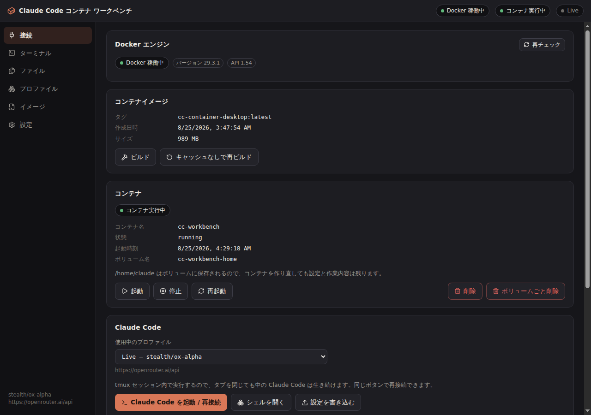
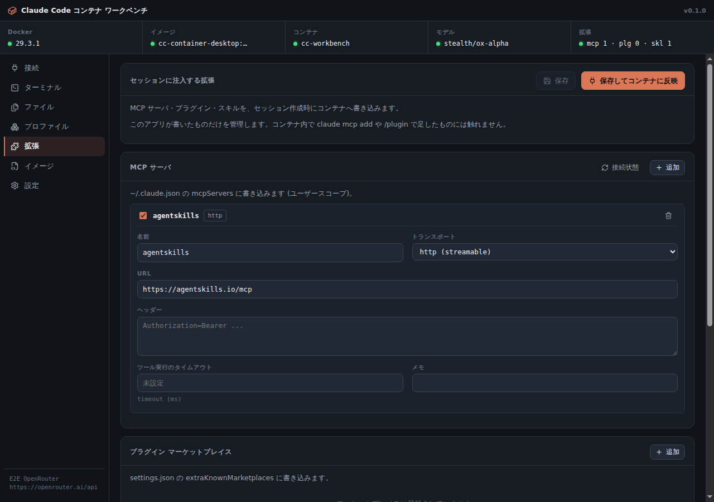

# Claude Code コンテナ ワークベンチ

Claude Code を Docker コンテナの中で動かす Windows 11 向け Electron アプリ。エンドポイント・モデル・API キーを用途ごとに差し替えられます。ローカルに Node も Claude Code も入れません。

[English](README.en.md)





## 必要なもの

Docker Desktop（起動していること）。開発する場合のみ Node.js 22 以上。

## 使い方

「接続」タブで **ビルド** → **起動** → **Claude Code を起動 / 再接続**。

- **プロファイル** — ベース URL・モデル・API キー。ベース URL に `/v1` は付けません（OpenRouter なら `https://openrouter.ai/api`）。入力欄の下に実際に叩く URL が出ます。API キーは OS の暗号化ストア（Windows は DPAPI）に入ります。
- **拡張** — MCP サーバ・マーケットプレイス・プラグイン・スキル。適用のたびにコンテナへ書き込みます。アプリが作ったキーだけを管理するので、コンテナ内で `claude mcp add` したものには触りません。
- **ファイル** — コンテナ内のファイルをそのまま編集。**ワークスペースを取り出す**で成果物を手動エクスポート（GitHub CLI は入れていません）。
- **イメージ** — `Dockerfile` / `setup.sh`（ビルド時に 1 回）/ `post-create.sh`（起動のたび）を UI から編集。
- **新しいセッション** — コンテナとホームボリュームを捨てて作り直し。イメージは残るので数秒で終わります。

タブを閉じても中の Claude Code は tmux セッションの中で生き続け、同じボタンで戻れます。

### スキルについて

`~/.claude/skills/<名前>/SKILL.md` に書き込みます。ディレクトリ名は frontmatter の `name` から決まります（`/コマンド名` もこれ）。`name` と `description` は必須で、満たしていないものは書き込まれず理由が出ます。`when_to_use` のような Claude Code 専用フィールドは書けますが、claude.ai へのアップロードや Skills API では弾かれるので警告が出ます。

## 動作確認

`tests/e2e/` の 4 スイートは、実際の Docker と実際のエンドポイントに対して走ります。モックはありません。

| スイート        | 内容                                                                                                                      | 項目数 |
| --------------- | ------------------------------------------------------------------------------------------------------------------------- | ------ |
| `workbench.mjs` | イメージ → コンテナ → 設定書き込み → `claude -p` が応答 → tmux 再接続                                                     | 29     |
| `deep.mjs`      | 入力欄への実タイピング、コンテナ停止中の挙動、壊れた JSON、CJK ファイル名、権限、エクスポート、リセット、拡張、データ保護 | 143    |
| `live.mjs`      | ツール実行、モデル別名、GUI ターミナル、再接続後の会話継続、MCP とスキルがモデルに届くか                                  | 23     |
| `packaged.mjs`  | 固めたバイナリを起動して `resourcesPath` からの解決を確認                                                                 | 9      |

```bash
CC_E2E_API_KEY=sk-or-v1-... npm run e2e:all        # Linux では xvfb-run -a を前に
CC_E2E_API_KEY=sk-or-v1-... npm run e2e:packaged   # 要 npm run pack:dir
```

OpenRouter + `stealth/ox-alpha` で全 204 項目の通過を確認済み。オンボーディング画面は一度も出ず、モデルは自分のツールでファイルを読み書きし、MCP ツールを実際に呼び、注入したスキルを実際に使い、再接続後も会話が続きます。他のプリセット（Anthropic / Moonshot / Z.ai / DeepSeek / MiniMax）は未検証です。

## 開発

```bash
npm install && npm run dev
npm run check      # format + lint + 型検査 + 依存の型 + build
npm run dist:win   # Windows x64 インストーラ → release/
```

```
src/main/      Electron メイン: docker/ claude/ config/ reset.ts
src/preload/   contextBridge（sandbox 有効）
src/renderer/  React 19 + xterm.js + CodeMirror 6
src/shared/    型・IPC 契約・i18n・SKILL.md 検証
docker/        Dockerfile / setup.sh / post-create.sh
```

レンダラーは `sandbox: true` / `contextIsolation: true` / `nodeIntegration: false`。Docker ソケットとホストのファイルシステムには、レンダラーからは直接触れません（IPC 経由でコンテナ内の操作はできます）。

CI は push と PR で format / lint / 型検査 / ビルド / パッケージ起動を回します。実 API を使う E2E は手動トリガー時のみ、リリースは手動トリガーのみです。

## うまくいかないとき

- **モデルのエラー** — ほぼベース URL です。`/v1` を外してください。
- **Docker 未検出** — Docker Desktop が起動しているか、`docker version` が通るか。
- **スキルが読み込まれない** — 「拡張」タブにエラーが出ていないか。`name` と `description` は必須です。
- **MCP が繋がらない** — 「接続状態」で `claude mcp list` の結果を確認。`stdio` はコマンドがコンテナ内にあるか、`http` はコンテナから URL に届くか。
- **イメージを更新したのに反映されない** — 「接続」タブでコンテナを削除して起動し直してください。
